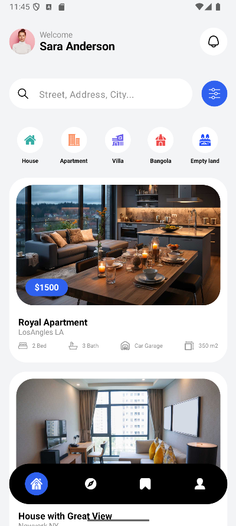

App de Aluguel em Kotlin

Um aplicativo Android elegante e funcional, feito em Kotlin e Jetpack Compose, que permite explorar e alugar imóveis de forma simples, inspirado em plataformas como Airbnb.

✨ Principais recursos:

🔹 Lista de imóveis com fotos, preços e descrições.

🔹 Detalhes completos de cada imóvel.

🔹 Interface moderna, totalmente declarativa com Jetpack Compose.

🔹 Projeto leve e educativo, perfeito para estudo ou prototipagem rápida.

🛠 Tecnologias utilizadas:

Kotlin – linguagem moderna e segura.

Jetpack Compose – UI declarativa e responsiva.

MVVM – arquitetura limpa para separar lógica e interface.

